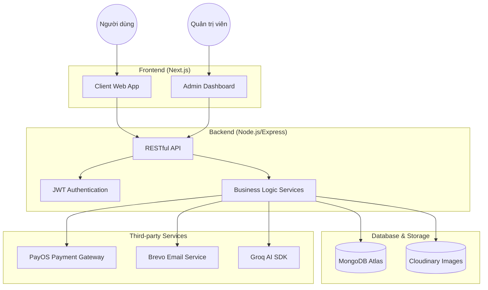

# Kiến trúc hệ thống - Book Hive

Dự án được xây dựng theo mô hình **Client-Server** tách biệt, sử dụng các công nghệ hiện đại để đảm bảo hiệu suất và khả năng mở rộng.

## Sơ đồ kiến trúc

## Giải thích các thành phần

1.  **Frontend (Next.js 14/15)**:
    - Sử dụng **App Router** cho cấu trúc route rõ ràng.
    - Kết hợp **SSR/SSG** để tối ưu SEO.
    - Quản lý state bằng **Redux Toolkit/Zustand**.
    - Gọi API bằng **React Query/RTK Query**.

2.  **Backend (Node.js/Express)**:
    - Cấu trúc thư mục theo **MVC (Models - Controllers - Routes)**.
    - Sử dụng **TypeScript** để tăng tính an toàn cho code.
    - Xác thực bằng **JWT** và bảo vệ route qua Middleware.

3.  **Database (MongoDB)**:
    - Cơ sở dữ liệu NoSQL linh hoạt.
    - Sử dụng **Mongoose** để định nghĩa schema và tương tác với dữ liệu.

4.  **Dịch vụ bên thứ ba**:
    - **Cloudinary**: Lưu trữ và tối ưu hóa hình ảnh sản phẩm/avatar.
    - **PayOS**: Cổng thanh toán trực tuyến nhanh chóng.
    - **Brevo**: Gửi email thông báo đơn hàng và mã OTP.
    - **Groq**: Cung cấp sức mạnh cho tính năng tư vấn sách bằng AI.
    - **Vercel**: Nền tảng Cloud dùng để deploy ứng dụng.
