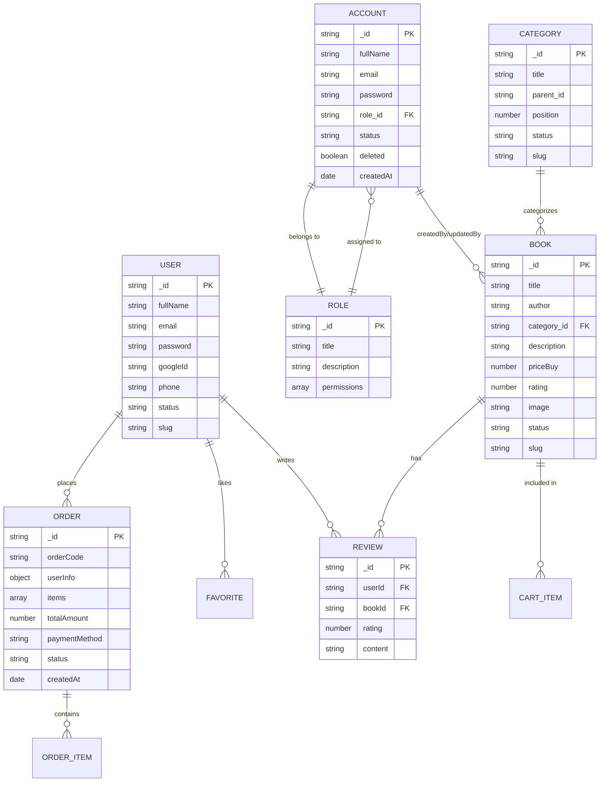

# Sơ đồ thực thể quan hệ (ERD) - Book Hive

Tài liệu này mô tả cấu trúc dữ liệu của dự án Book Hive sử dụng MongoDB.

## Các thực thể chính

1.  **Account**: Tài khoản quản trị hệ thống (Admin/Staff).
2.  **User**: Người dùng cuối (Khách hàng) mua sách.
3.  **Book**: Thông tin sản phẩm sách.
4.  **Category**: Danh mục sách (hỗ trợ phân cấp cha-con).
5.  **Order**: Thông tin đơn hàng và thanh toán.
6.  **Role**: Phân quyền cho các tài khoản quản trị.
7.  **Review**: Đánh giá của người dùng về sách.
